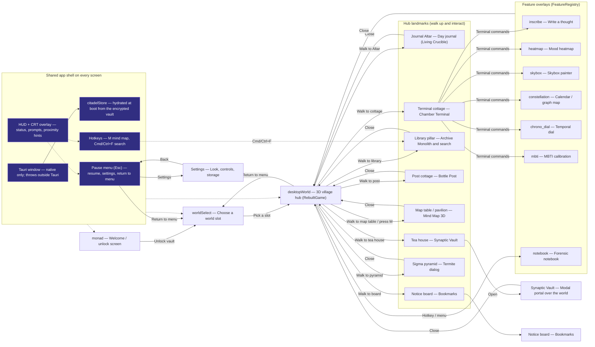

# Sigma Engine Citadel: App Flow

Screen and feature flow, from launch to every overlay reachable in the world.
Sources: `src/app/App.tsx`, `RebuiltGame.tsx`, `FeatureRegistry.ts`.

```mermaid
flowchart LR
  subgraph shell["Shared app shell on every screen"]
    direction TB
    tauri["Tauri window — native only; throws outside Tauri"]
    store["citadelStore — hydrated at boot from the encrypted vault"]
    hud["HUD + CRT overlay — status, prompts, proximity hints"]
    pause["Pause menu (Esc) — resume, settings, return to menu"]
    keys["Hotkeys — M mind map, Cmd/Ctrl+F search"]
    tauri --> store
    hud -.-> pause
    hud -.-> keys
  end

  monad["monad — Welcome / unlock screen"]
  select["worldSelect — Choose a world slot"]
  world["desktopWorld — 3D village hub (RebuiltGame)"]
  vault["Synaptic Vault — Modal portal over the world"]
  settings["Settings — Look, controls, storage"]
  notices["Notice board — Bookmarks"]

  subgraph landmarks["Hub landmarks (walk up and interact)"]
    direction TB
    altar["Journal Altar — Day journal (Living Crucible)"]
    cottage["Terminal cottage — Chamber Terminal"]
    library["Library pillar — Archive Monolith and search"]
    post["Post cottage — Bottle Post"]
    mapTable["Map table / pavilion — Mind Map 3D"]
    tea["Tea house — Synaptic Vault"]
    sigma["Sigma pyramid — Termite dialog"]
    board["Notice board — Bookmarks"]
  end

  subgraph overlays["Feature overlays (FeatureRegistry)"]
    direction TB
    inscribe["inscribe — Write a thought"]
    heatmap["heatmap — Mood heatmap"]
    skybox["skybox — Skybox painter"]
    constellation["constellation — Calendar / graph map"]
    chrono["chrono_dial — Temporal dial"]
    mbti["mbti — MBTI calibration"]
    notebook["notebook — Forensic notebook"]
  end

  monad -->|"Unlock vault"| select
  select -->|"Pick a slot"| world
  world -->|"Return to menu"| select

  world -->|"Walk to Altar"| altar
  world -->|"Walk to cottage"| cottage
  world -->|"Walk to library"| library
  world -->|"Walk to post"| post
  world -->|"Walk to map table / press M"| mapTable
  world -->|"Walk to tea house"| tea
  world -->|"Walk to pyramid"| sigma
  world -->|"Walk to board"| board

  tea -->|"Open"| vault
  board --> notices
  keys -.->|"Cmd/Ctrl+F"| library
  cottage -->|"Terminal commands"| inscribe
  cottage -->|"Terminal commands"| heatmap
  cottage -->|"Terminal commands"| skybox
  cottage -->|"Terminal commands"| constellation
  cottage -->|"Terminal commands"| chrono
  cottage -->|"Terminal commands"| mbti
  world -->|"Hotkey / menu"| notebook

  altar -->|"Close"| world
  library -->|"Close"| world
  post -->|"Close"| world
  mapTable -->|"Close"| world
  vault -->|"Close"| world
  sigma -->|"Close"| world
  overlays -->|"Close"| world

  pause -->|"Settings"| settings
  settings -->|"Back"| pause
  pause -->|"Return to menu"| select

  shell -.-> monad
  shell -.-> select
  shell -.-> world

  classDef shellStyle fill:#312e81,stroke:#a78bfa,color:#fff
  class tauri,store,hud,pause,keys shellStyle
```
